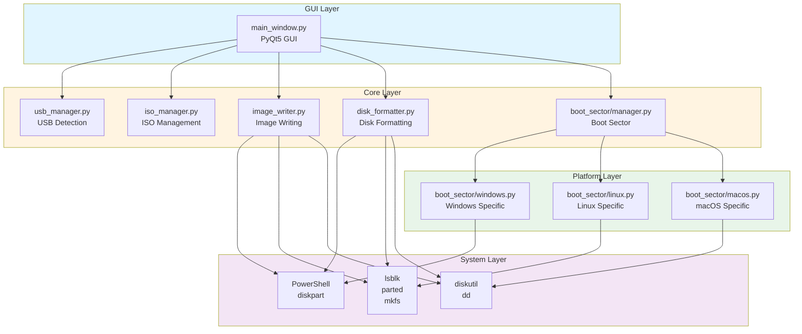
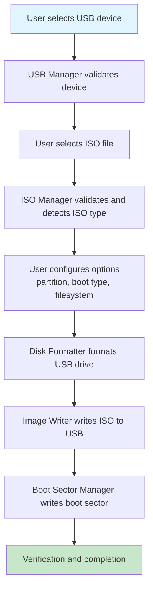
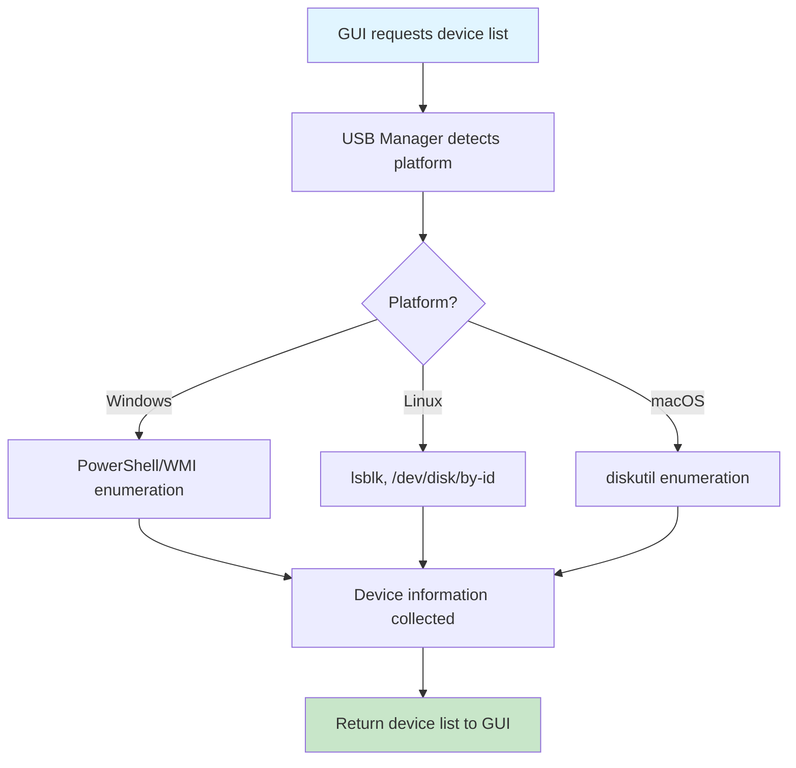
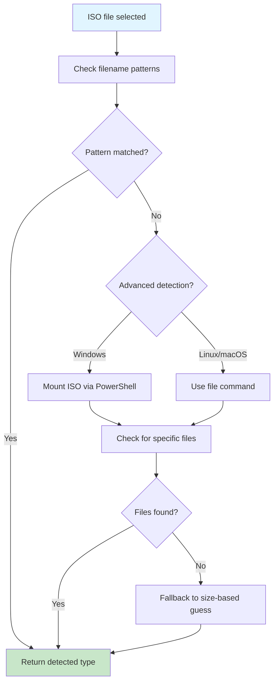
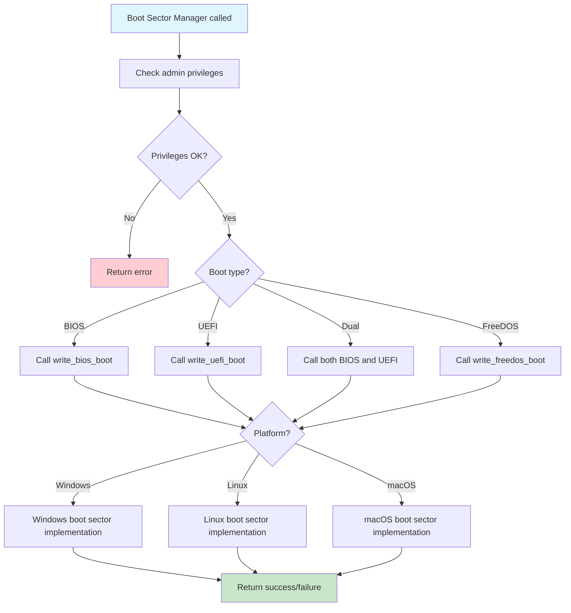

# Architecture Documentation

This document describes the architecture and design of SmartBoot.

## Overview

SmartBoot is a cross-platform application for creating bootable USB drives from ISO images. It is built using Python 3 and PyQt5 for the GUI.

## Architecture Diagram

## Module Structure

### GUI Layer (`gui/`)

#### main_window.py
- Main application window
- User interface components
- Event handling
- Progress display
- Orchestrates core module interactions

### Core Layer (`core/`)

#### usb_manager.py
- USB device detection
- Device information retrieval
- Platform-specific device enumeration
- Device validation

**Key Methods:**
- `get_devices()` - List available USB devices
- `get_device_details()` - Get detailed device information

#### iso_manager.py
- ISO file validation
- ISO type detection
- ISO information extraction
- ISO content inspection

**Key Methods:**
- `get_iso_info()` - Get ISO metadata
- `validate_iso()` - Validate ISO file
- `_determine_iso_type()` - Detect ISO type

#### image_writer.py
- ISO writing to USB
- Direct image writing (dd-like)
- File extraction and copying
- Progress tracking

**Key Methods:**
- `write_iso()` - Write ISO to USB
- `write_disk_image()` - Write raw disk image
- `_write_windows_iso()` - Windows-specific ISO writing
- `_write_linux_iso()` - Linux-specific ISO writing
- `_write_image_direct()` - Direct write mode

#### disk_formatter.py
- Disk partitioning
- Filesystem formatting
- Partition scheme management (MBR/GPT)
- Platform-specific formatting

**Key Methods:**
- `format_disk()` - Format disk with specified filesystem
- `_format_windows()` - Windows formatting
- `_format_linux()` - Linux formatting
- `_format_macos()` - macOS formatting

#### boot_sector/manager.py
- Boot sector writing coordination
- Platform-specific delegation
- Boot type selection (BIOS/UEFI/Dual/FreeDOS)
- Privilege checking

**Key Methods:**
- `write_boot_sector()` - Write boot sector based on options

#### boot_sector/base.py
- Base class for boot sector implementations
- Common boot sector utilities
- MBR creation/generation

#### boot_sector/windows.py
- Windows-specific boot sector writing
- bootsect.exe integration
- BCD store configuration
- UEFI boot file installation

**Key Methods:**
- `write_bios_boot()` - Write BIOS boot sector
- `write_uefi_boot()` - Write UEFI boot files
- `write_freedos_boot()` - Write FreeDOS boot sector

#### boot_sector/linux.py
- Linux-specific boot sector writing
- syslinux/extlinux integration
- GRUB installation
- UEFI bootloader setup

**Key Methods:**
- `write_bios_boot()` - Write BIOS boot sector
- `write_uefi_boot()` - Write UEFI boot files
- `write_freedos_boot()` - Write FreeDOS boot sector

#### boot_sector/macos.py
- macOS-specific boot sector writing
- Limited BIOS boot support
- UEFI bootloader setup

**Key Methods:**
- `write_bios_boot()` - Write BIOS boot sector
- `write_uefi_boot()` - Write UEFI boot files
- `write_freedos_boot()` - Write FreeDOS boot sector

### Utilities Layer (`utils/`)

#### logger.py
- Logging configuration
- File and console handlers
- Log rotation
- Platform-specific log locations

## Data Flow

### Bootable USB Creation Flow

### Device Detection Flow

### ISO Type Detection Flow

### Boot Sector Writing Flow

## Design Patterns

### Strategy Pattern
Platform-specific implementations are selected at runtime:
- USB detection (Windows/Linux/macOS)
- Disk formatting (Windows/Linux/macOS)
- Boot sector writing (Windows/Linux/macOS)

### Factory Pattern
BootSectorManager creates platform-specific boot sector implementations based on the operating system.

### Template Method Pattern
BaseBootSector defines the interface, with platform-specific implementations providing concrete behavior.

### Observer Pattern
Progress callbacks allow the GUI to observe and display progress from core operations.

## Key Design Decisions

### PyQt5 for GUI
- Cross-platform native look and feel
- Rich widget set
- Good documentation
- Widely used and stable

### Platform-Specific Implementations
- Each platform has unique tools (PowerShell, diskpart, dd, diskutil)
- Abstraction layer provides consistent interface
- Fallback mechanisms for reliability

### Modular Architecture
- Clear separation of concerns
- Easy to test individual components
- Facilitates maintenance and extension

### Progress Callbacks
- Non-blocking operations
- Real-time user feedback
- Cancellable operations (future enhancement)

## Error Handling

### Exception Handling
- Try-catch blocks at critical points
- Graceful degradation with fallbacks
- User-friendly error messages

### Validation
- Device validation before operations
- ISO file validation
- Parameter validation
- Privilege checking

### Logging
- Comprehensive logging at all levels
- Error logging with context
- Debug logging for troubleshooting

## Security Considerations

### Privilege Requirements
- Administrator/root required for disk operations
- Privilege checking before operations
- Clear error messages for insufficient privileges

### Data Safety
- Device selection confirmation
- Warning before destructive operations
- No automatic operations without user consent

### Input Validation
- ISO file validation
- Device path validation
- Parameter sanitization

## Performance Considerations

### Asynchronous Operations
- Long-running operations should be non-blocking (future enhancement)
- Progress callbacks for user feedback

### Memory Management
- Streaming for large file operations
- Temporary file cleanup
- Resource cleanup on deletion

### Caching
- Device information caching (future enhancement)
- ISO type detection caching (future enhancement)

## Future Enhancements

### Planned Features
- Command-line interface
- Batch processing
- Multi-boot USB support
- Persistent storage for Linux
- Verification of written data
- Caching mechanisms
- Asynchronous operations

### Architecture Improvements
- Plugin system for filesystem/bootloader support
- Configuration file support
- Profile management
- Internationalization (i18n)

## Testing Strategy

### Unit Tests
- Test individual modules in isolation
- Mock platform-specific calls
- Test error handling paths

### Integration Tests
- Test module interactions
- Test with real USB devices (carefully)
- Test with various ISO types

### Platform Tests
- Test on Windows, Linux, macOS
- Test different versions
- Test different filesystems

## Dependencies

### Runtime Dependencies
- Python 3.7+
- PyQt5 >= 5.15.0

### Platform-Specific Tools
- Windows: PowerShell, diskpart, bootsect.exe
- Linux: lsblk, parted, mkfs.*, dd, syslinux
- macOS: diskutil, dd

### Development Dependencies
- pytest (testing)
- pylint (linting)
- black (formatting)

## Configuration

### Application Configuration
- Log level
- Log location
- Default options (future)

### User Configuration
- Preferred options (future)
- Device profiles (future)
- ISO history (future)
